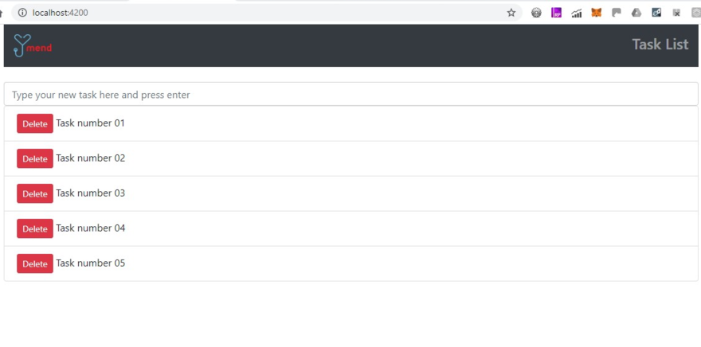

<p align="center"></p>

# Mend Family Challenging Code

# Summary
```
The main target was developing a full stack web application, 
with a responsive frontend, dinamically updated (AJAX) 
connecting a RESTful layer backend based on HTTP Services

```

---------

## Software Stack

* PHP 7.2 ^
* Laravel 5.5 ^
* Node 10 ^
* NPM 5 ^
* Angular 6 ^
* MySQL 7 ^
* Composer

-----------


## Backend instructions
-----------

### Database - MySQL
```
1. mysql -uroot -p
2. CREATE DATABASE mendapp;
3. CREATE USER 'mendapp'@'localhost' identified by 'mendapp';
4. GRANT ALL on mendapp.* to 'mendapp'@'localhost';
5. quit
```
### PHP/Laravel
```
1. Go to folder backend\mendapp 
2. Execute 'composer install'
3. Execute 'php artisan migrate'
4. Execute 'php artisan serve'

Verify on http://localhost:8000/api/tasks
```
### Frontend instructions
```
1. Go to folder frontend\mendappfront
2. Execute 'npm install'
3. Execute 'ng serve -o'

Verify on http://localhost:4200
```

### Ending points
```
http://localhost:8000/api/tasks GET - return JSON nodes of tasks
http://localhost:8000/api/tasks POST - {task : '[string]'} - create a task
http://localhost:8000/api/tasks/{id} PUT - {task : '[string]'} - update a task
http://localhost:8000/api/tasks/{id} DELETE - delete a task
```
